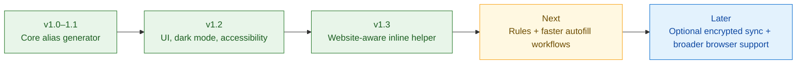

# Roadmap

This roadmap tracks what Gmail Alias Toolkit has already delivered, what is being researched, and the next practical improvements for the extension.

> The roadmap is directional rather than a release commitment. Priorities may move based on browser limitations, privacy review, maintenance cost, and user feedback.

## Status legend

- ✅ Shipped
- 🧪 Research / prototype
- 🚧 Planned
- 💡 Exploratory

## Product evolution

## ✅ Shipped

### v1.0–v1.1 — Core alias workflow

- Gmail plus-address alias generation.
- Random and custom-tag generators.
- Built-in and user-defined presets.
- Keyboard shortcuts.
- Alias history and usage statistics.

### v1.2 — UI and usability foundation

- Unified modern popup UI.
- Light and dark themes.
- Improved history table, settings, Gmail tricks, and generator flows.
- Better keyboard accessibility and focus behavior.
- Locale coverage checks.

### v1.3 — Website-aware aliases

- Website-aware suggestions derived from the current hostname.
- Inline helper beside detected email fields.
- Main-account selection and live alias previews.
- Previous alias lookup for the current website.
- Multi-account history isolation.
- Google Workspace domain preservation.
- Favorites, search, filters, pagination, QR sharing, and JSON/CSV export.
- Chrome, Firefox, Edge, and Opera release packages.
- 14 UI languages.
- Local-first storage with no required remote alias-generation API.

## 🧪 Research in progress

### Store-backed update prompt

Tracked in issue #84 and draft PR #83.

Research goals:

- Verify `runtime.requestUpdateCheck()` behavior across Chromium browsers and Firefox.
- Test the complete Store-installed update lifecycle rather than relying on unpacked builds.
- Handle staged Store rollouts and popup-close lifecycle cases.
- Decide whether the extra update UI is useful enough compared with native browser auto-update behavior.
- Keep ZIP/manual installations explicitly separated from Store update behavior.

The prototype should remain isolated until end-to-end Store testing is complete.

## 🚧 Next priorities

### 1. Website alias rules

Move from a single hostname-derived suggestion to configurable rules per website.

Examples:

- `amazon.com → shopping`
- `github.com → dev`
- `booking.com → travel`
- selected account + preferred preset + naming format per domain

Planned capabilities:

- Domain-to-preset mapping.
- Per-site preferred account.
- Per-site alias format.
- Reuse existing alias / always create a new alias option.
- Wildcard or parent-domain rules where safe.
- Import/export of site rules.

### 2. One-action autofill

Reduce the current flow from “open suggestion → choose → use” when the intent is obvious.

Planned options:

- Insert the selected alias directly into the active email field.
- Generate-and-fill from the browser context menu.
- Keyboard command for “generate and fill”.
- Optional automatic copy after generation.
- Remember the last choice for the current site.

Autofill behavior must remain explicit and user-controlled; the extension should not silently submit forms.

### 3. Alias lifecycle and organization

Improve management once users have hundreds of aliases.

Planned additions:

- Notes attached to aliases.
- User tags/categories independent of the alias text.
- Status such as Active, Archived, and Deprecated.
- Last-used and use-count fields.
- Duplicate / near-duplicate detection.
- Bulk archive, favorite, delete, and retag actions.
- Better website grouping in history.

### 4. Safer backup and restore

The extension already supports import/export. The next step is making backup safer and easier to move between devices.

Planned additions:

- Versioned backup schema.
- Import preview before overwriting local data.
- Merge vs replace restore modes.
- Duplicate detection during import.
- Migration validation for older exports.
- Optional password-protected encrypted backup file.

### 5. Optional cross-device sync

Keep local-only storage as the default.

Explore an opt-in sync layer for settings, rules, presets, and alias metadata:

- Browser sync storage where feasible.
- End-to-end encrypted portable sync payload.
- Explicit conflict resolution.
- Per-account sync enable/disable.
- Never require cloud sync for core alias generation.

This should be implemented only if privacy and browser quota limitations are acceptable.

### 6. Inline helper reliability

Website form markup varies widely, so inline detection should keep improving.

Planned work:

- Better detection for dynamically mounted SPA forms.
- Shadow DOM compatibility where browser permissions allow.
- Improved handling of custom email-input components.
- Prevent duplicate helper injection during aggressive rerenders.
- Site-specific compatibility tests for common signup flows.
- Performance profiling on long-lived tabs.

### 7. Privacy and permission hardening

Continue reducing the amount of page access required by the extension.

Planned work:

- Review whether broad host permissions can become optional permissions.
- Keep local-only processing for alias generation.
- Add a visible diagnostics page showing enabled permissions and stored data categories.
- Provide one-click deletion by account/site/category.
- Add regression checks preventing accidental telemetry or remote data transmission.
- Document exactly what is stored and why.

### 8. Browser parity

Current releases cover major desktop browser packages; feature behavior should be explicitly tested rather than assumed identical.

Planned browser matrix:

- Chrome.
- Firefox.
- Edge.
- Opera.
- Brave compatibility checks.
- Safari feasibility study.

Each browser should document differences in permissions, commands, inline injection, Store updates, and packaging.

### 9. Accessibility and localization

- Automated accessibility checks for popup and inline helper.
- Reduced-motion support for animated UI.
- Full keyboard operation for alias selection and management.
- RTL readiness.
- Translation completeness checks for every new user-facing string.
- Review long translated strings against the fixed popup width.

### 10. Release confidence

- Cross-browser smoke tests before release.
- Store package validation in CI.
- Automated verification that changelog version matches package version.
- Release artifact integrity checks.
- Optional beta channel for risky browser-specific features.
- Documented rollback procedure.

## 💡 Exploratory ideas

These are intentionally lower priority and should not complicate the local-first core.

### Privacy dashboard

Show useful local insights such as:

- websites with the most aliases;
- aliases reused across multiple sites;
- dormant aliases not used recently;
- accounts with unusual alias growth;
- cleanup suggestions.

All analysis should run locally.

### Rule suggestions

Suggest a site rule after repeated behavior, for example:

> You used the `shopping` preset on this domain three times. Save it as the default rule?

The extension should never silently create behavioral rules.

### Alias health checks

For Gmail-style aliases, the extension cannot know whether a website has leaked or sold an address without mailbox access. A future health view could still identify local hygiene issues such as reuse, excessive age, or duplicate naming patterns without reading email.

### Provider adapters

Investigate a clean adapter architecture for users who also rely on alias services such as SimpleLogin or similar providers.

This would be optional and separate from Gmail plus-addressing. It should not add remote-service dependencies to the default experience.

### Developer diagnostics

- Debug mode for email-field detection.
- Export sanitized diagnostics for bug reports.
- Compatibility report showing current hostname, detected fields, active rules, and relevant browser capabilities.

## Non-goals

To keep the project focused:

- No mailbox content reading as part of the core feature set.
- No silent form submission.
- No mandatory hosted backend.
- No analytics/tracking requirement.
- No automatic upload of alias history.
- No promise that Gmail dot variations behave as independent mailboxes; they remain alternate representations handled by Gmail.

## Suggested release grouping

### v1.4

Focus: faster day-to-day workflows.

- Website alias rules.
- Generate-and-fill.
- Improved inline helper reliability.
- Alias notes and organization.
- Backup import preview / merge mode.

### v1.5

Focus: privacy, reliability, and scale.

- Permission hardening.
- Diagnostics/privacy dashboard.
- Bulk alias management.
- Cross-browser compatibility suite.
- Accessibility and localization improvements.

### v2.0

Only after the local-first workflow is mature.

Potential scope:

- Optional encrypted cross-device sync.
- Provider adapter architecture.
- Major storage schema revision if required.
- Safari support if technically and operationally sustainable.
